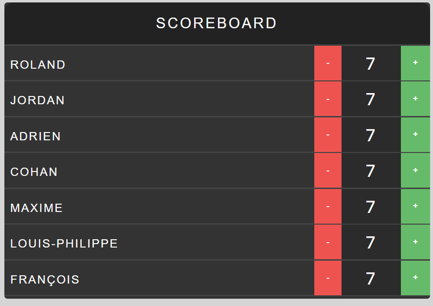

#REACT DEMO WITH TYPESCRIPT
This is a repo to start learning react with typescript and webpack.

The tutorial is organized into steps. ***You can switch the branches in ascending order to follow along***

## How to follow along
1. Clone the repository by running `git clone https://github.com/rokal/react-typescript-webpack.git `
2. `npm install`
3. `npm run build` 
4. run `live-server` and you will see your app

## Step 2
We'll here by setting up a scoreboard view and then we'll build the base components to refactor the app. We are going add some features to dynamize the application.

To follow along, run `git checkout step2-1`

To see the final result `git checkout step2-2`

### What we've added
In this step, we came with a base template (Thanks to [Jim Hoskins](https://teamtreehouse.com/jim)) to works with. Jim created a react tutorial on [teamtreehouse](https://teamtreehouse.com/library/react-basics) but uses ES5. 
We'll be using the base template as him and with our typescript skills, we'll make another approach to design the scoreboard application.

This image is our base template.

In the next step, we are going to split this template into reusable components.

